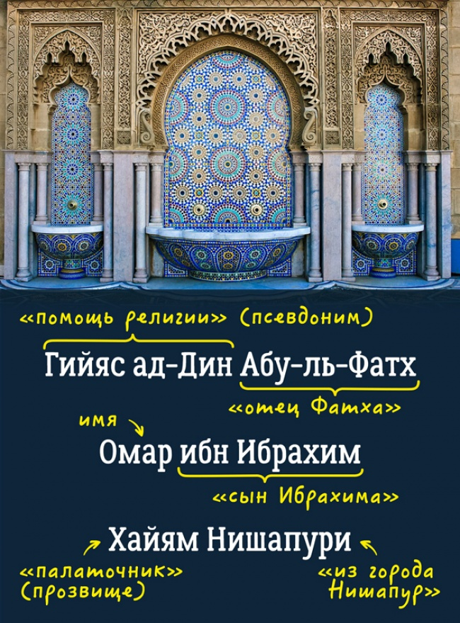

### Трудные авторы

#### Испанские (иберийские) фамилии

В испано- и португалоязычных регионах планеты существуют сходные правила построения имён, эти правила берут начало из ономастических традиций Испании и Португалии, известных под общим названием ибери́йское и́мя.

В большинстве случаев иберийское имя состоит из составного личного имени и хотя бы двух фамилий. В официальных документах (паспорт, титул на собственность) используется полное имя, но в повседневном обороте почти всегда используются часть личного имени и лишь одна из фамилий. Неверное сокращение иберийских фамилий довольно часто приводит к недоразумениям в прессе и литературе на других языках.

Испанцы, как правило, имеют две фамилии. Например, дочь Antonio Campos Rodríguez (Антонио Кампос Родригес) и María Martínez Marqués (Марии Мартинес Маркес) зовут María Campos Martínez (Мария Кампос Мартинес). Обращаться к дочери следует Señorita Campos, а не Señorita Martínez. гораздо реже.

При замужестве женщины не меняют фамилию.

**Гарсиа Лорка, Федерико** - здесь Гарсиа - фамилия отца, а Лорка - фамилия матери.

**Гарсиа Маркес, Габриэль Хосе де ла Конкордиа** - здесь Гарсиа - фамилия отца, а Маркес - фамилия матери.

**Кастро Рус, Фидель Алехандро** - десь Кастро - фамилия отца, а Рус - фамилия матери.

**Гевара де ла Серна, Эрнесто Рафаэль** (Че Гевара, Эрнесто) - Прозвище Че использовал для того, чтобы подчеркнуть своё аргентинское происхождение. Междометие che является распространенным обращением в Аргентине.

**Чавес Фриас, Уго Рафаэль** (Чавес, Уго) - здесь Чавес - фамилия отца, а Фриас - фамилия матери.

**Руис-и-Пикассо, Пабло Диего Хосе Франсиско де Паула Хуан Непомусено Мария де лос Ремедиос Сиприано де ла Сантисима Тринидад Мартир Патри́сио** (Пикассо, Пабло) - здесь Руис - фамилия отца, а Пикассо - фамилия матери.

**Ортега-и-Гассет, Хосе** - здесь Ортега - фамилия отца, а Гассет - фамилия матери.

**Варгас Льоса, Хорхе Марио Педро** - здесь Варгас - фамилия отца, а Льоса - фамилия матери.

#### Португальские имена

Португальская система именования достаточно гибкая. При рождении ребёнок может получить одно или два имени, и до четырёх фамилий. Дети получают фамилию от обоих родителей. Обычно фамилия от матери предшествует фамилии отца, но обратное тоже возможно.

Испанцы ставят фамилию отца перед фамилией матери, португальцы и бразильцы — наоборот, однако порядок может измениться. Также между именами могут появиться короткие слова, как то de или e между словами: Carreño de Quiñones, Tavares e Silva.

#### Бразильские имена

У бразильцев также бывает до четырех фамилий, наследуемых от предков, например José Eduardo Santos Tavares Melo Silva.

Испанцы ставят фамилию отца перед фамилией матери, португальцы и бразильцы — наоборот, однако порядок может измениться. Также между именами могут появиться короткие слова, как то de или e между словами: Carreño de Quiñones, Tavares e Silva.

#### Римские фамилии

В классическое время полное римское мужское имя обычно состояло из трёх компонентов: личного имени, или преномена (praenomen), родового имени, или номена (nomen), и индивидуального прозвища или наименования ветви рода, когномена (cognomen).

Личное имя было подобно современному мужскому имени. Римляне употребляли небольшое число личных имен (18 имён из общего количества 72): Аппий, Авл, Децим, Гай, Гней, Кезон, Луций, Мамерк, Маний, Марк, Нумерий, Публий, Квинт, Сервий, Секст, Спурий, Тит, Тиберий.

Родовое имя было названием рода и соответствовало, приблизительно, современной фамилии. Указывалось в форме прилагательного мужского рода и оканчивалось в классическую эпоху на -ius: Tullius — Туллий (из рода Туллиев), Julius — Юлий (из рода Юлиев); в республиканское время встречаются также окончания -is, -i. Родовые имена неримского происхождения имели отличные от названных окончания.

Индивидуальное прозвище, данное некогда кому-либо из представителей рода, часто переходило на потомков и становилось названием семьи или отдельной ветви рода: Cicero — Цицерон, Caesar — Цезарь. Например, к роду Корнелиев принадлежали семьи Сципионов, Руфинов, Лентулов и т. д. Наличие когномена не обязательно, и в некоторых плебейских родах (у Мариев, Антониев, Октавиев, Серториев и др.) личные прозвища, как правило, отсутствовали. Однако отсутствие когномена было исключением из правил, так как многие роды Рима были столь древнего происхождения, что каждый из них насчитывал по несколько ветвей.

#### Греческие имена

Греческое имя, в соответствии с антропонимической моделью греков, состоит из трёх частей, идущих в следующем порядке: индивидуальное имя, имя отца в родительном падеже и фамилия.

#### Французские имена

Французское законодательство позволяет человеку иметь несколько личных имён. Только одно из них (как правило, первое) используется в повседневной практике, остальные — только в официальных документах, таких как свидетельства о рождении, смерти и браке. Не путать с составными именами католической традиции: Жан-Клод, Жан-Жак. Такие конструкции являются одним (единым и неделимым) именем. Жан-Клода ни при каких обстоятельствах не назовут ни Жаном, ни Клодом.

#### Английские имена

Традиционно в англоговорящих странах ребёнок при рождении получает два имени: личное имя (англ. personal name, first name) и среднее имя (англ. middle name). Наиболее важным, существенным представляется именно первое, личное имя.

#### Ирландские имена

Ирландские фамилии и имена отражают разнообразие традиций, языков, которые были интегрированы в современную ирландскую культуру. Ирландские личные имена обычно берут своё начало в древних кельтских именах, кельтской христианской традиции, и аглицированных формах гэльских имен.

В фамилиях используются префиксы Мак и О': Маккартни (англ. McCartney), О’Салливан (англ. O'Sullivan), О’Брайен (англ. O'Brien).

#### Исландские имена

Исландское имя состоит из совокупности имени, отчества (патронима) и в очень редких случаях — фамилии. Большинство исландцев имеют только имя и отчество (подобная практика существовала прежде и в скандинавских странах). В обращении и при упоминании человека употребляется только имя, независимо от того, обращается ли говорящий к данному лицу на «вы» или на «ты». Отчество представляет собой сложную конструкцию, состоящую из имени отца в родительном падеже и слов «сын» (исл. son, русский аналог «-вич») — для мужчин — или «дочь» (исл. dóttir, русский аналог «-вна») — для женщин. Например, Лейф Эрикссон (исл. Leifur Eiriksson), Снорри Стурлусон (исл. Snorri Sturluson), Ингибьёрг Стефаунсдоуттир (исл. Ingibjörg Stefánsdóttir), Бьорк Гвюдмюндсдоуттир (Björk Guðmundsdóttir). Иногда вместо патронима используется матроним — форма, производная от имени матери. Например, Хейдар Хельгюсон (сын Хельги), Вигдис Хельгюдоуттир (дочь Хельги). В некоторых случаях используется комбинация матронима и патронима, например, Дагюр Бергтоурюсон Эггертссон (Dagur Bergþóruson Eggertsson), мэр Рейкьявика. В случаях, когда можно спутать двух полных тёзок по имени и отчеству, применяется отчество второго порядка (по имени деда). Например, Йоун Тоурссон Бьярнарсонар (Jón Þórsson Bjarnarsonar) — Йоун, сын Тоура, сына Бьярни. Такая конструкция весьма обычна в сагах, хотя в настоящее время встречается редко (чаще используется среднее имя).

Фамилии имеет лишь очень небольшое число исландцев. Чаще всего фамилии исландцев наследуются от родителей иностранного происхождения. Примерами известных исландцев, имеющих фамилии, могут служить футболист Эйдур Гудьонсен, актёр и режиссёр Балтазар Кормакур, актриса Анита Брием, премьер-министр Гейр Хилмар Хорде. Имеющие фамилии нередко вставляют между именем и фамилией отчество в сокращенной форме. При вступлении в брак имена супругов не изменяются, если только жена не берёт фамилию мужа — в тех редких случаях, когда он её имеет.

До 1925 года — момента, когда вопрос именования был урегулирован на законодательном уровне — существовала легальная процедура получения исландцами произвольных фамилий. Такой возможностью воспользовался, к примеру, лауреат Нобелевской премии по литературе 1955 года Халлдор Кильян Лакснесс (урождённый Хальтоур Гвюдйоунссон).

#### Венгерские имена

Венгерские имена выделяются на фоне всех остальных именных моделей Европы. Их особенностью является восточный порядок следования имени и фамилии (характерный для Китая, Кореи и Японии), при котором фамилия предшествует имени. Такой порядок объясняется тем, что фамилия выступает в качестве определения, а потому ставится перед определяемым словом (именем). Ударение в венгерских именах (как и во всех венгерских словах) всегда падает на первый слог.

Интересная история произошла в Венгрии. Раньше здешние женщины, выходя замуж, брали не только фамилию мужа, но и его имя. То есть Мария Иванко, обручившись с человеком по имени Петер Ковач, меняла свои имя и фамилию на Петер Ковачне.

Эта традиция жива до сих пор, но женщин, которые следуют ей, остается все меньше.

#### Литовские имена

Окончания женских и мужских фамилий в Литве, как и в России, различаются: у мужчины по фамилии Катилюс есть сестра по фамилии Катилюте, у Даукантаса — Даукантайте.

При этом у замужних женщин суффикс будет другим: например, девушка по фамилии Варнате после замужества станет Варнене... Как все непросто!

Также с 2003 года женщины могут вообще не использовать суффиксы — индикаторы семейного положения.

Что касается имен, то они в Литве бывают двойные и одинарные.

#### Арабские имена

Арабская система имён считается одной из наиболее сложных среди современных традиций именования: большинство арабов не имеют простого имени, состоящего из личного имени и фамилии, но обладают длинной цепочкой имён.

Арабское «Абу Карим Мухаммед аль-Джамил ибн Нидал ибн Абдулазиз ал-Филистини» переводится как «Отец Карима, Мухаммед (личное имя), Красивый, Сын Нидала, Сын Абдулазиза, Палестинец», при этом Карим — первый сын Мухаммеда. Для дополнительной информации о подобной традиции богатых и длинных имен см. статью «Википедии».

**Омар Хайям** - Гийясаддин Абу-ль-Фатх Омар ибн Ибрахим аль-Хайям Нишапури. Гийяс ад-Дин - хитаб, «помощь религии», Абу-ль-Фатх - кунья, «отец Фатха» (у него не было сына по имени «Фатх»), Омар — исм (личное имя), ибн Ибрахим - насаб, «сын Ибрахима», Хайям  - тахаллус, «палаточный мастер» (предположительно, указание на ремесло отца; от слова «хайма» — палатка, от этого же слова предположительно происходит старорусское «хамовник» — текстильщик), Нишапури — нисба, «из Нишапура».

**Ибн Сина** (Авиценна) - Абу Али Хусейн ибн Абдуллах ибн аль-Хасан ибн Али ибн Сина.

#### Индийские имена

В Северной Индии история с именами простая: есть просто имя и просто фамилия. В Южной же наблюдается такая картина: отчество отца становится именем сына, а фамилии может не быть.

А еще в этой стране по некоторым фамилиям можно сказать, к какой касте относились предки человека, к примеру известную фамилию Чопра носили только кшатрии — представители одной из самых значимых каст.

Женщины при замужестве берут фамилию мужа.

#### Китайские имена

Именование человека в китайской, а также связанных с ней культурах отличается от системы имён, принятой на Западе. Наиболее заметным признаком этого различия является то, что в китайском полном имени сначала пишется фамилия, и только после неё — личное имя.

Китайские женщины при замужестве фамилию не меняют.

Разнообразие имён на китайском языке в значительной степени зависит от личного имени, а не фамилии. Подавляющее большинство китайских фамилий записываются одним иероглифом, лишь несколько — двумя (в КНР официальные списки содержат около 20 таких «нестандартных» фамилий, тогда как остальные были приведены к стандартному односложному виду, включая фамилии нацменьшинств, зачастую состоящие из более, чем 2 слогов. Наиболее распространённые китайские фамилии: Ли (кит. трад. 李, пиньинь: Lǐ), Ван (кит. трад. 王, пиньинь: Wáng), Чжан (кит. трад. 張, упр. 张, пиньинь: Zhāng).

Китайские женщины, выходя замуж, как правило, сохраняют свои девичьи фамилии и не принимают фамилию мужа (в Китайской Народной Республике почти повсеместно). Дети, как правило, наследуют фамилию отца.

В русском языке между китайскими фамилией и именем обычно ставится пробел: Фамилия Имя, при этом имя пишется слитно. В старых источниках китайские имена записывали через дефис (Фэн Юй-сян), однако позднее стало принятым слитное написание (правильно — Фэн Юйсян).

Детское имя. Например, Ли Чжэньфань (Брюс Ли) имел детское имя Ли Сяолун (Ли Маленький Дракон), ставшее впоследствии его прозвищем.

Второе имя (字, zì) — это имя, даваемое при достижении совершеннолетия (字, zì), которое используются в течение жизни. После 20 лет второе имя даётся как символ взросления и уважения. Первоначально такие имена использовались после мужских имён, человек мог получить второе имя от родителей, от первого учителя в первый день посещения семейной школы, либо мог сам избрать для себя второе имя. Традиция использования вторых имён постепенно начала исчезать со времён Движения 4 Мая (1919). Существуют две общепринятые формы второго имени: Цзы 字 (zì) и Хао 號 (hào).

Прозвание, хао — это альтернативное второе имя, которое обычно используется в качестве псевдонима. Чаще всего оно состоит из трёх или четырёх иероглифов и, возможно, изначально стало популярным, потому что у многих людей часто были одинаковые вторые имена. Люди чаще всего выбирали Хао сами себе и могли иметь больше одного прозвища. Хао никак не было связано с именем, данным человеку при рождении и его вторым именем; скорее, прозвище было чем-то личным, иногда эксцентричным. Выбор псевдонима мог воплощать аллюзию либо содержать редкий иероглиф, точно так же, как и мог подходить высокообразованному литератору. Другая возможность — использовать название места жительства человека в качестве псевдонима; таким образом, псевдоним поэта Су Ши — Дунпо Цзюши (то есть «Резиденция Дунпо» («На восточном склоне»)) — резиденция, которую он построил, будучи в ссылке. Авторы часто использовали псевдонимы в названиях сборников своих работ.

В китайском имени 毛泽东 («Мао Цзэдун») фамилией является «Мао», то есть первое при чтении слева направо. Личным именем является «Дун». Средний же слог «Цзэ» является именем поколения, и един для всех его братьев и сестер: 毛泽民 (Мао Цзэминь), 毛泽覃 (Мао Цзэтань), 毛泽紅 (Мао Цзэхун)

Китайская система имен является основой для всех традиционных способов именования людей в Восточной Азии.

Среди людей, которые не являются близкими к нему, к Мао могут обратиться как к 毛泽东先生 («Мао Цзэдун сяньшэн») или 毛先生 («Мао сяньшэн»), где «сяньшэн» — некий аналог «мистер» или «господин». Хотя на данный момент не у всех есть имя поколения, особенно в континентальном Китае, те, у кого оно есть, будут считать должным использование его вместе с личным именем. Поэтому, к человеку по имени 毛泽东 нельзя обратиться просто как 东, следует использовать 泽东.

Китайцы, контактируя с представителями западной цивилизации, могут добавлять дополнительное личное имя, которое будет привычней для их новых друзей. К примеру, Яо Мин (фамилия — Яо, личное имя — Мин) может назваться иностранцам как Фред Яо Мин или Фред Мин Яо.

#### Корейские имена

Корейское имя состоит из фамилии и следующего после него личного имени.

В большинстве случаев фамилия состоит из одного слога, а имя из двух слогов. Как имя, так и фамилия часто записываются с помощью ханча — китайских иероглифов, отражающих корейское произношение. Ханча более не используются в Северной Корее, а их использование для имён в Южной Корее сокращено до 5038 иероглифов. При использовании европейских языков некоторые корейцы сохраняют традиционный порядок написания, а другие меняют его согласно западной схеме. В Корее женщина, выходя замуж, обычно сохраняет девичью фамилию.

В Корее используется всего около 250 фамилий. Самыми распространёнными из них являются Ким, Ли и Пак. Однако большинство однофамильцев не являются близкими родственниками. Происхождение корейских фамилий тесно связано с корейской историей и географией. Существует множество кланов, каждый из которых связан с определённым местом, как, например, Кимы из Кимхэ. В большинстве случаев каждый клан прослеживает свою родословную до общего предка по мужской линии.

#### Прочие

**Абай Кунанбаев** (Кунанбаев, Ибрагим) - казахский поэт, композитор; Абай ("внимательный, осторожный") - прозвище.

**Алигьери, Данте** (Durante degli Alighieri) - итальянские фамилии оканчиваются на букву "И", в основном, получается Алигьери это фамилия. Итальянские имена оканчиваются в основном на "Е", следовательно "Данте" имя. **посмотреть в Литературной энциклопедии**

**Энтони Диллингэм Джейкоб, Пирс** (Энтони, Пирс) - американский писатель-фантаст английского происхождения.

***

Схема «имя-отчество» также используется в южной Индии, Малайзии и Индонезии.

Малайское имя «Иса бин Осман» можно разбить на имя и отчество. Слово «бин» означает «сын (кого-либо)», у женщин используется «бинти». Для того, чтобы обратиться к этому человеку, подойдет «г-н Иса», «мистер Иса».

Во многих частях света различные составляющие имени человека происходят от названий населенных пунктов, генеалогических особенностей, касты, религиозного статуса и т.д. Приведем несколько примеров:

Индийское имя «Когадду Бираппа Тимаппа Наир» следует рассматривать как комбинацию «название деревни — имя отца — личное имя — фамилия».

Раджастханское имя «Адитья Пратап Сингх Чаухан» состоит из личного имени, имени отца, фамилии и названия касты.

В другом регионе Индии имя «Мадурай Мани Айер» нужно толковать как набор «название города — личное имя — название касты».

У жителей Таиланда есть прозвище, которым они называют друг друга в неофициальных ситуациях. Прозвище изначально никак не связано с настоящим именем. Поскольку прозвище состоит из одного-двух слогов, и его легче произносить, тайцы представляются иностранцам именно им. Например, прозвище бывшего премьер-министра Таксин Чиннават — Мау (แม้ว). Часто прозвища для семьи и друзей различаются.

Во Вьетнаме имя Nguyễn Tấn Dũng (Нгуен Тан Зунг) имеет смысл «фамилия — второе имя — личное имя». Хотя подобная система похожа на китайскую, есть небольшое отличие: даже в официальных ситуациях к премьер-министру Вьетнама нужно обращаться «г-н Зунг», а не «г-н Нгуен», то есть по имени.

https://habr.com/post/130361/
