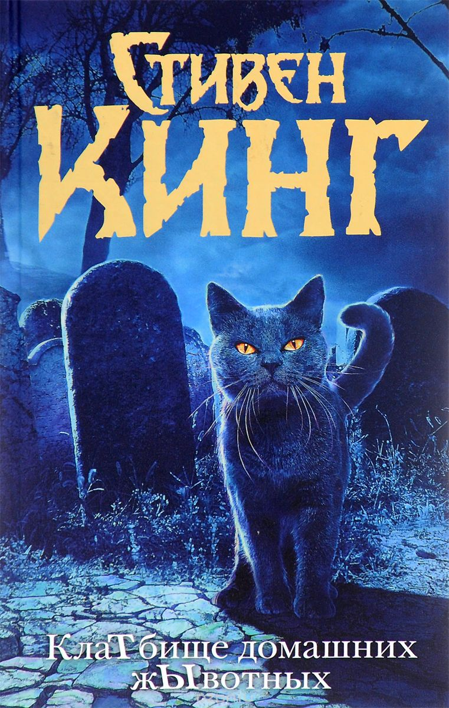

### Трудные заглавия

Кинг, Стивен (американский писатель ; 1947- ).

&nbsp;&nbsp;&nbsp;&nbsp;&nbsp;**Клатбище домашних жывотных** : [роман] / Стивен Кинг ; [пер. с англ. Т. Ю. Покидаевой]. - Москва : АСТ, 2016. - 478 с. - Вариант заглавия : Кладбище домашних животных . - ISBN 978-5-17-089240-2 : 319.34 р.

Новый шокирующий перевод романа.

